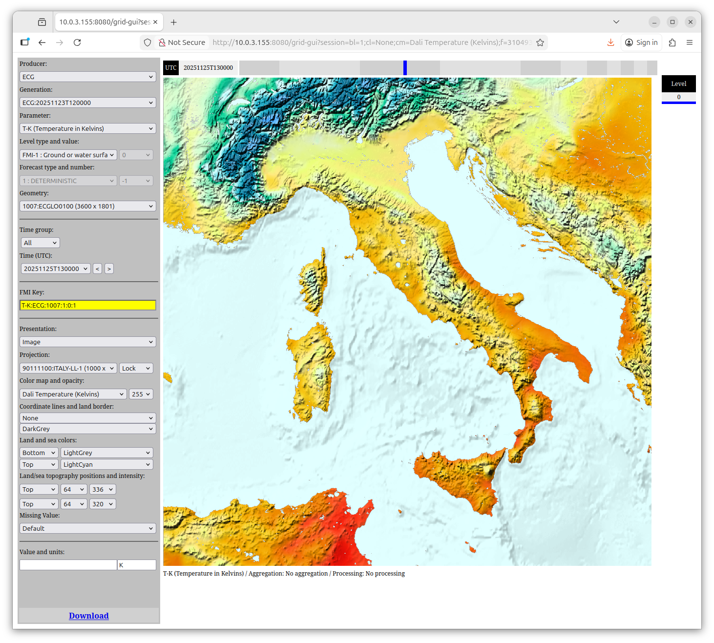

Grid-GUI Plugin
===============
## Introduction

The Grid-GUI Plugin can be used in order to visualize grid files, which information is registered into the Content Information Storage. Originally this plugin was created in order to help the development work in the grid support project. In other words, we just wanted to see that our key components were working correctly and they can open different kinds of grid files and support multiple projections. In addition, it offered us a nice way to see almost all information that was stored into the Content Information Storage.

We noticed that the Grid-GUI was very useful and that's why we decided to publish it. However, it is good to understand that this is a very special tool and it was not originally designed for very wide use. In other words, in spite of that this GUI is quite functional, we could develop even better GUIs if we had more time for this. In practice, this GUI demonstrates some of the capabilities that the grid support brings to developers. 

The figure below shows the basic outlook of the Grid-GUI.  

## Visualization

The basic idea of the visualization is that we imagine grids to be two dimensional images that contain different colors. I.e. grid values can be changed to colors. For example, if we have a grid that contains wind speed values we can convert these values to colors so that bigger values (= strong wind) are converted to darker colors and smaller values (= weak wind) are converted to lighter colors.  

On the other hand, we can define actual color mappings for some grid values. In this case we need to use configuration files where different value ranges are mapped into different colors. The figure below shows, how different temperature values are mapped into different colors.  

We have added continental borders and coordinate lines in the previous images. These help us to geographically locate the current grid information. In some cases this is not enough. For example, a grid can be from an area where no recognizable borders are available. In this case we can draw the grid into the world map and this way see its geographical location.  

## Configuration

The main configuration file of the Grid-GUI Plugin is read once when the server is started. The main configuration file of the SmartMet Server should point to this file. 

The configuration file contains a some references to other files (color maps, etc.) these files are dynamical configuration files, which are loaded in use automatically if they change. Unfortunately, we can only update these files without restart, but if we want to add new color map files then we have to restart the system. 

## Licence
The Grid-GUI plugin is a part of the SmartMet Server (https://github.com/fmidev/smartmet-server), which is published with MIT-license.

## How to contribute
Found a bug? Want to implement a new feature? Your contribution is very welcome!

Small changes and bug fixes can be submitted via pull request. In larger contributions, premilinary plan is recommended (in GitHub wiki). 

CLA is required in order to contribute. Please contact us for more information!

## Documentation
SmartMet Server Grid support (https://github.com/fmidev/smartmet-tools-grid/raw/master/doc/grid-support.pdf)

## Communication and Resources
You may contact us from following channels:
* Email: beta@fmi.fi
* Facebook: https://www.facebook.com/fmibeta/
* GitHub: [issues](../../issues)

Other resources which may be useful:  
* Presentation about the server: http://www.slideshare.net/tervo/smartmet-server-providing-metocean-data  
* Our public web pages (in Finnish): http://ilmatieteenlaitos.fi/avoin-lahdekoodi   

